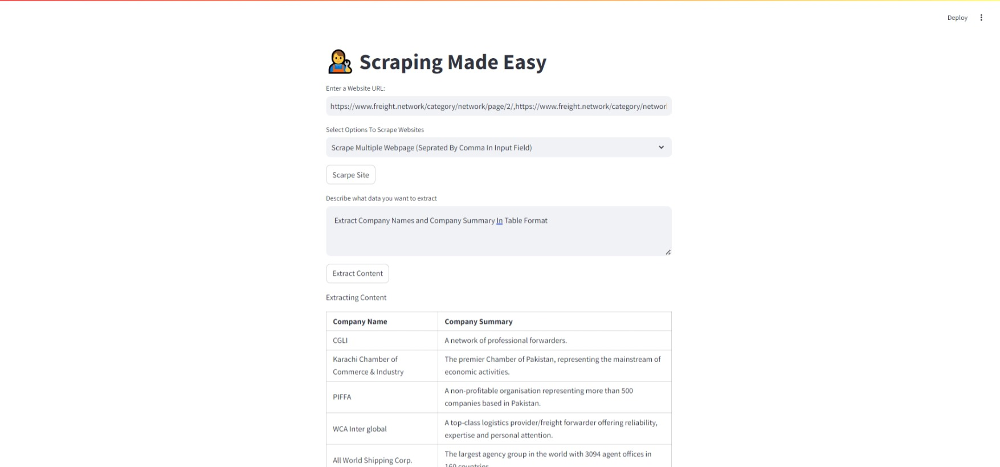

## REQUIREMENTS
* Download ollama https://github.com/ollama/ollama
```bash
pip install -r requirements.txt
```
## Download llama3.2
```bash
ollama pull llama3.2
```
## Run Scraper
```bash
streamlit run AI Scraper.py
```
## Have Fun
